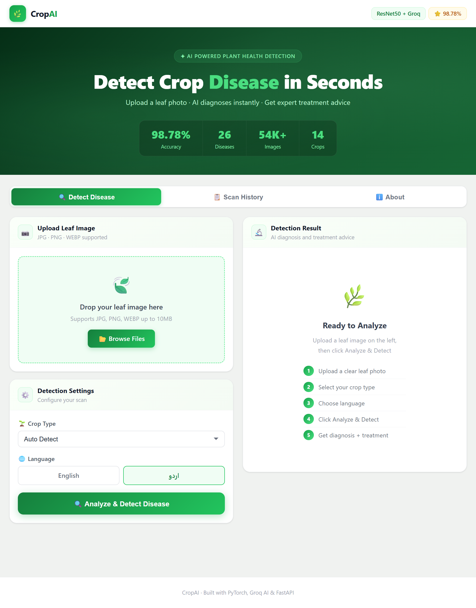
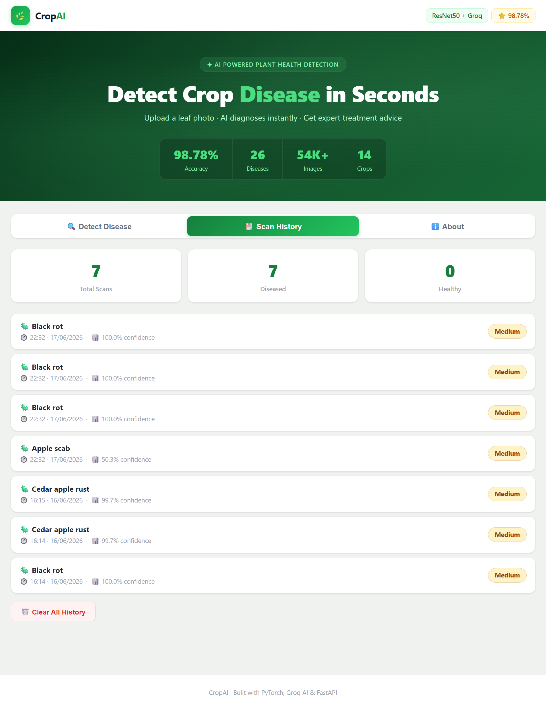
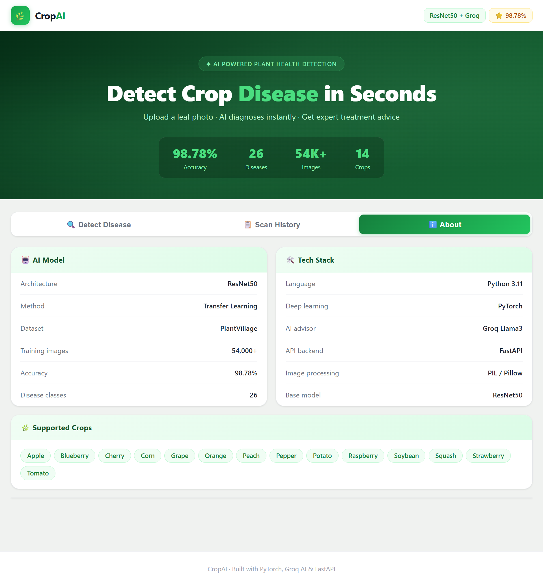

# 🌾 CropAI — AI Crop Disease Detector

Detect crop diseases instantly using AI. Upload a crop leaf image and receive disease predictions, confidence scores, and treatment recommendations in English or Urdu.

## 🔗 Live Demo

| Resource | Link |
|----------|------|
| 🌐 Live App | https://crops-disease-detector.vercel.app |
| ⚡ API Docs | https://uzairalee100-crop-disease-api.hf.space/docs |
| 💻 Source Code | https://github.com/uzairalee100/crop-disease-detector |

## ✨ Features

- 📷 Upload crop leaf images
- 🤖 AI disease detection
- 📊 Confidence score prediction
- 💊 Treatment recommendations
- 🌐 English and Urdu support
- 📋 Scan history tracking
- 📱 Fully responsive design
- ⚡ FastAPI backend
- 🧠 ResNet50 deep learning model

- ## 📸 Application Screenshots

### 🔍 Disease Detection

Upload a crop leaf image and get instant disease predictions.

---

### 📋 Scan History

View all previous scans and prediction history.

---

### ℹ️ About CropAI

Information about the AI model, dataset, and project.

## 🎓 What I Learned

Through this project I gained practical experience with:

- PyTorch Deep Learning
- Transfer Learning using ResNet50
- Data Augmentation
- FastAPI Development
- REST API Design
- Docker
- Hugging Face Spaces
- Vercel Deployment
- Llama 3 Integration
- Full Stack AI Development
